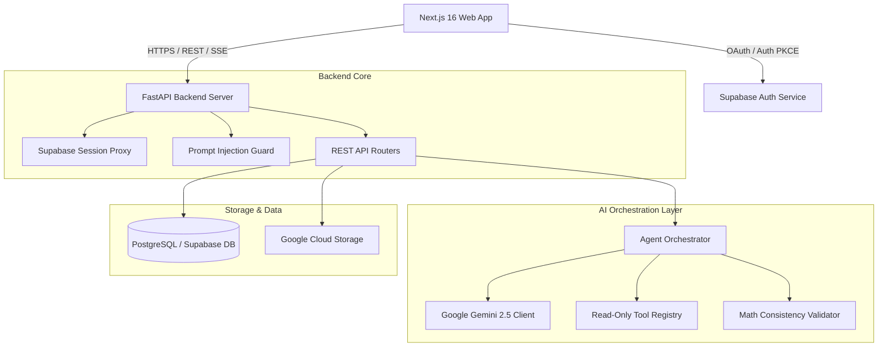

# 👕 EVE — Inventory & Business Intelligence Platform for D2C Brands

[](https://www.eveinventory.in)
[](https://nextjs.org/)
[](https://fastapi.tiangolo.com/)
[](https://www.python.org/)
[](https://supabase.com/)
[](#license)

> **EVE (Enterprise Virtual Executive)** transforms raw spreadsheets, invoices, and sales velocity logs into automated inventory intelligence, margin optimizations, and verifiable executive decision recommendations for growing D2C apparel brands.

---

## 📸 Interface Overview

```
┌──────────────────────────────────────────────────────────────────────────────────┐
│  EVE Inventory Intelligence Dashboard                                 [Demo Workspace] │
├──────────────────────────────────────────────────────────────────────────────────┤
│ ┌──────────────┐  ┌──────────────┐  ┌──────────────┐  ┌──────────────┐            │
│ │ Inventory Val│  │ Stockout Risk│  │  Dead Stock  │  │  Reorder Qty │            │
│ │   ₹4,820,000 │  │   14 SKUs    │  │   8 SKUs     │  │   1,250 Units│            │
│ └──────────────┘  └──────────────┘  └──────────────┘  └──────────────┘            │
│                                                                                  │
│ ┌──────────────────────────────────────────────┐ ┌──────────────────────────────┐ │
│ │  Executive Summary & Baseline Insights       │ │ Master CSV Data Ingestion    │ │
│ │  • Reorder SKU-LUMA-01 (Stockout in 3 days)  │ │ [ Drop Master CSV File Here ]│ │
│ │  • Liquidate 8 dead-stock SKUs (180+ days)   │ │  Supports: SKU, Stock, Cost  │ │
│ └──────────────────────────────────────────────┘ └──────────────────────────────┘ │
└──────────────────────────────────────────────────────────────────────────────────┘
```

---

## 💡 Why EVE?

Fast-growing D2C fashion brands operate across fragmented tools—spreadsheets, supplier invoices, sales platforms, and manual stock logs. This fragmentation causes three major cash leaks:

1. **Unseen Stockouts**: Fast-selling core lines run out of stock unnoticed, burning marketing spend and customer lifetime value.
2. **Working Capital Trapped in Dead Stock**: Slow-moving apparel items (180+ days velocity stalls) lock up working capital on warehouse shelves.
3. **Margin Erosion**: Selling prices set without elasticity visibility lead to negative net margin sales.

**EVE unifies inventory analytics, document processing, and AI executive guidance into a single workspace.**

---

## 🔑 Core Capabilities

### 📦 1. Inventory Intelligence Engine
* **Master CSV Ingestion**: Drag-and-drop unified CSV parser (`sku`, `name`, `stock`, `cost`, `selling_price`, `sales_quantity`).
* **Automated Stockout Risk Detection**: Predicts exact days until stockout per SKU based on daily run-rates and safety stock buffers.
* **Dead Stock Analyzer**: Flags items exceeding 180 carrying days or zero sell-through rate to unlock trapped warehouse capital.
* **Retail Math & Elasticity Optimization**: Automatically calculates **GMROI** (Gross Margin Return on Investment), Sell-Through Rates, Inventory Turnover, and price elasticity.

### 🤖 2. Autonomous AI COO & Multi-Agent Assistant
* **Context-Aware DAG Orchestrator**: Powered by Gemini 2.5 Flash, decomposing complex business goals into task execution graphs.
* **Specialized Domain Agents**:
  * **Analytics Agent**: Verifies gross sales, revenue aggregates, and retail math.
  * **Inventory Agent**: Evaluates stock coverage and safety buffers.
  * **Pricing Agent**: Simulates price changes and net profit impact.
  * **Sourcing & Market Agents**: Analyzes supplier lead times and competitor pricing.
* **Single Source of Truth Traceability**: Every recommendation is logged to an immutable `recommendation_traces` database table complete with confidence scores, data evidence snapshots, and versioning.

### 📄 3. Document Intelligence (OCR)
* **Automated Document Extraction**: Parses supplier invoices, purchase orders, and receipts using Cloud Vision API (with local Tesseract fallback).
* **Data Extraction & Scoring**: Extracts vendor names, line items, tax breakdown, and total amounts while calculating data quality confidence scores.

### 💼 4. Business Operations Workspace
* **Client & CRM Management**: Tracks customer acquisition, account statuses, and churn risks.
* **Projects & Task Tracking**: Organizes team workflows, project milestones, and delivery deadlines.
* **Financial Tracking**: Tracks gross sales GMV, operating expenses, and category profit margins.

---

## 🏗️ Technical Architecture



---

## 🛡️ Security Architecture & Guardrails

EVE enforces enterprise-grade security across data isolation, AI execution, and user authentication:

* **Strict Multi-Tenant Scoping**: Every database query is isolated by `organization_id` extracted from verified JWT tokens and `X-Workspace-Id` headers.
* **Read-Only AI Tools**: The AI Agent layer is strictly read-only. All 5 registered tools execute SELECT queries. The AI agent **cannot modify or delete database records**.
* **Prompt Injection Protection**: Dual-layer defense utilizing `PromptInjectionGuard` with Unicode NFKC normalization, l33tspeak decoding, and 18 regex injection patterns.
* **RBAC & Endpoint Protection**: REST endpoints enforce strict minimum workspace role requirements (`employee` < `manager` < `admin` < `owner`).

---

## 🛠️ Technology Stack

| Layer | Technology |
|---|---|
| **Frontend Framework** | Next.js 16.2.7 (App Router with Turbopack), React 19 |
| **Frontend Styling** | CSS Tokens, Tailwind CSS, Shadcn UI |
| **Backend Framework** | FastAPI 0.110.0 (Python 3.11+) |
| **Database & ORM** | PostgreSQL (Supabase), SQLAlchemy 2.0, Alembic |
| **AI & LLM Integration** | Google Gemini 2.5 Flash, Google GenAI SDK |
| **OCR & Vision** | Google Cloud Vision API, Tesseract OCR |
| **Cloud & Deployment** | Google Cloud Run, Vercel, Google Cloud Storage |

---

## 📁 Repository Structure

```
Aethercorp-EVE/
├── backend/
│   ├── app/
│   │   ├── agents/            # Specialized domain AI agents & tool declarations
│   │   ├── core/              # Security, JWT, Tool Registry, & Middleware
│   │   ├── models/            # SQLAlchemy DB models (Organization, Product, Trace)
│   │   ├── routes/            # REST API endpoints (Inventory, Executive, Account)
│   │   ├── schemas/           # Pydantic data validation models
│   │   └── services/          # Core services (Analytics, Account, Document OCR)
│   ├── alembic/               # Database migration scripts
│   └── tests/                 # Backend test suite
├── frontend/
│   ├── src/
│   │   ├── app/               # Next.js App Router pages (/dashboard, /owner, etc.)
│   │   ├── components/        # React UI components (Dashboard, Sidebar, Charts)
│   │   ├── lib/               # Utility libraries & Supabase client setup
│   │   └── proxy.ts           # Next.js 16 middleware proxy for session handling
└── docs/                      # Architectural docs & security audits
```

---

## ⚡ Quick Start & Local Setup

### Prerequisites
* Node.js 20+
* Python 3.11+
* PostgreSQL instance (or Supabase project)

### 1. Clone the Repository
```bash
git clone https://github.com/devottamkumar1310-cpu/EVE-Inventory-Intelligence.git
cd EVE-Inventory-Intelligence
```

### 2. Backend Setup
```bash
cd backend
python -m venv .venv
source .venv/bin/activate  # On Windows: .venv\Scripts\activate
pip install -r requirements.txt

# Configure Environment Variables
cp .env.example .env

# Run Database Migrations & Start Server
alembic upgrade head
uvicorn app.main:app --reload --port 8000
```

### 3. Frontend Setup
```bash
cd ../frontend
npm install

# Configure Environment Variables
cp .env.example .env.local

# Run Development Server
npm run dev
```
Open [http://localhost:3000](http://localhost:3000) in your browser.

---

## 🗺️ Product Roadmap

- [x] **Unified Master CSV Data Ingestion**
- [x] **Deterministic Inventory Intelligence Engine** (Stockout, Dead Stock, ROP)
- [x] **Multi-Agent AI Executive Assistant** (Gemini 2.5 Flash)
- [x] **Immutable Recommendation Traceability** (`recommendation_traces`)
- [x] **Document Intelligence OCR Engine** (Invoices, Receipts)
- [x] **Owner Telemetry Dashboard** (`/owner` Executive view)
- [ ] **Direct E-Commerce Integrations** (Shopify, WooCommerce, Amazon Sellers)
- [ ] **Supplier Purchase Order Auto-Generation** (Automated PDF RFQ generation)
- [ ] **Multi-Currency & International Tax Scenarios**

---

## 📜 License

This repository is proprietary software owned by **Aethercorp / EVE**. All rights reserved.
