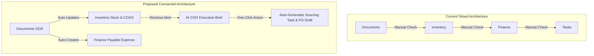
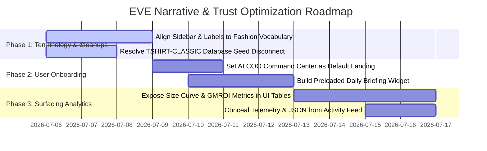

# EVE — D2C Fashion Founder Experience Audit

This audit evaluates the EVE (Enterprise Virtual Executive) Business Operating System from the perspective of a **first-time Direct-to-Consumer (D2C) fashion founder**. It analyzes user experience, narrative coherence, vocabulary alignment, data integrity, and strategic prioritization to help EVE transition from a collection of separate features into a high-trust, unified AI partner.

---

## Executive Summary: The D2C Founder's Lens

A first-time D2C fashion founder lives in a fast-paced environment characterized by high capital constraints. Their survival depends on managing cash runway, predicting manufacturing lead times, optimizing sizing runs, and clearing dead inventory to release capital. They are not enterprise resource planners or developers; they are brand-builders who use Shopify, Instagram Ads, and Excel spreadsheets.

### The Good (Trust Anchors)
* **Inventory Intelligence is the hero page**: The calculations for stockout risks, safety stock, and capital lockup address a founder's deepest operational anxieties.
* **Document Intelligence feels like magic**: Processing raw vendor invoices and extracting margins instantly demonstrates that EVE can automate manual bookkeeping.
* **Explainable AI panels**: The "Data Used" and "Reasoning Summary" sections in the AI Assistant side panel ground EVE in mathematical reality, preventing the LLM from appearing like a simple chatbot wrapper.

### The Bad (Friction Points)
* **Agency/B2B Terminology in a D2C Product**: Landing pages and sidebars referencing "Clients," "Projects," and "Completed Tasks" make EVE look like a Trello clone for marketing agencies or consulting firms rather than a tool for retail brands.
* **Disconnected Data Streams**: The relationships between modules (e.g., how uploading a supplier invoice in *Documents* updates *Inventory* levels and creates *Finance* ledger records) are buried, forcing the user to verify data manually.
* **Developer Exposure**: Exposing JSON trace logs, database telemetry, and "confidence scores" in the Activity Feed and Traceability pages erodes trust, making EVE feel like an unstable, raw developer prototype rather than a finished business tool.

---

## Focus Area Audits

### 1. Obviousness of Module Purposes
Each module has varying levels of clarity and value alignment for a D2C retail founder:

| Module | UI Route | Obvious Purpose? | D2C Founder Assessment |
| :--- | :--- | :--- | :--- |
| **Inventory Intelligence** | `/dashboard/inventory` | **Yes (High Value)** | **Excellent.** Metrics like *Capital Lockup* and *Stockout Risk* directly target margin preservation. |
| **Document Intelligence** | `/dashboard/documents` | **Yes (Moderate Value)** | **Good.** Understood as an administrative OCR tool. It could be framed more dynamically around *Supplier Invoice Verification*. |
| **AI Assistant (COO)** | `/dashboard/eve` | **Yes (High Value)** | **Excellent Concept.** However, the initial screen is a blank prompt box, which can cause "blank-page syndrome." |
| **Finance** | `/dashboard/finance` | **Yes (Moderate Value)** | **Clear, but manual.** Founders don't want to type manual ledger entries; they expect automated transaction syncing from Shopify/Stripe. |
| **Clients** | `/dashboard/clients` | **No (Confusing)** | **Irrelevant.** D2C brands sell to thousands of consumer shoppers, not "Clients." This terminology implies a service agency model. |
| **Projects & Tasks** | `/dashboard/projects` | **No (Confusing)** | **Mismatched.** A project manager views tasks as "milestones," but a fashion founder views operations as *Production Runs*, *Shipment Trackings*, and *Collection Launches*. |
| **Decision Traceability** | `/dashboard/traceability`| **No (Obscure)** | **Too Technical.** Explaining confidence scores and agent routing looks like developer diagnostics. The founder wants business justifications, not mathematical proofs. |
| **Activity Feed** | `/dashboard/activity` | **No (Confusing)** | **Harmful to Trust.** Exposing Event Bus JSON payloads makes the platform look unpolished and unstable. |

---

## 2. Module Relationships & Integration
Currently, EVE operates as a series of isolated feature tabs rather than a unified business loop. 

#### The Disconnect
* Uploading a fabric invoice in *Documents* updates inventory and expenses in the database, but this relationship is not visually tracked.
* A predicted stockout in *Inventory* recommends a reorder, but this recommendation does not automatically link to a *Task* in the Tasks module or generate a draft Purchase Order in *Documents*.
* *Finance* metrics do not automatically update based on inventory valuations or sales reports.



---

## 3. Demo Workspace Realism
The demo workspace (**NovaWear Fashion**) attempts to simulate a struggling apparel manufacturer. It has strengths but contains architectural inconsistencies:

* **The Retail Client Paradox**: The workspace seeds buyers like "Retail Buyer A Ltd" under "Clients" and manages them as B2B projects. While fashion brands occasionally have wholesale accounts, a first-time D2C founder expects to see Shopify integrations, sales velocity, and direct consumer customer metrics, not B2B agency contract files.
* **The Missing SKU Disconnect**: 
  * The demo database seeds denim items (`DD-BEST-001`, `DD-DEAD-101`, etc.) into the inventory catalog.
  * However, `june_sales_report.csv` seeds sales for **`TSHIRT-CLASSIC`**, a product that **does not exist** in the seeded catalog.
  * Consequently, the AI makes restocking recommendations for `TSHIRT-CLASSIC` while the Inventory dashboard displays denim metrics. This disconnect makes the database feel artificial and buggy.
* **Material vs. Finished Goods Flatlist**: The inventory mixes raw materials (`FABRIC-COTTON-01`) and finished apparel products (`Slim Fit Black Jeans`) in a single list. In fashion, raw materials are tracked in a Bill of Materials (BOM) and are not sold directly to consumers, making a single flat list feel unrealistic.

---

## 4. The 30-Second Value Identification
Can a user identify EVE's value within 30 seconds? **No, because of onboarding routing and dashboard layouts.**

1. **Onboarding Redirection**: Upon completing onboarding, EVE redirects the user to `/dashboard/inventory`. While this page has strong metrics, a raw table of inventory numbers does not immediately highlight EVE's unique value proposition: the multi-agent AI COO.
2. **Operations Dashboard as Landing Page**: If the user visits the default `/dashboard` page, they are greeted by a generic CRM dashboard.
3. **Buried AI Capabilities**: The AI multi-agent orchestrator is hidden under the "AI Assistant" sidebar tab. To experience EVE's core differentiator, the user has to click through the sidebar and write a prompt.

---

## 5. Screens that Create Confusion vs. Trust

#### Confusing Screens (Undermining Trust)
1. **Activity Feed (`/dashboard/activity`)**: Displays raw Event Bus logs and JSON execution traces. A fashion founder will be confused by developer outputs like `{"agent": "operations", "event": "calculate_velocity"}`.
2. **Decision Traceability (`/dashboard/traceability`)**: Shows complex confidence graphs and agent weights. This feels like an AI developer's playground, creating anxiety that the system is experimental.
3. **Clients and Projects Tabs**: These pages suggest that EVE is built for creative agencies or software developers rather than retail logistics.

#### Trust-Building Screens (Enhancing Trust)
1. **Inventory Intelligence (`/dashboard/inventory`)**: Displays specific retail calculations (COGS, Dead Stock Value, Reorder Recommendations).
2. **Document OCR Preview (`/dashboard/documents`)**: Displaying the document side-by-side with the AI's confidence scores and extraction outputs proves the tool is grounded in actual documents.
3. **AI Reasoning Panel**: Surfacing the specialized agents (e.g., Sourcing Agent, Sizing Agent, Finance Agent) and listing the exact data sources used (e.g., `Sales Ledger`, `Inventory CSV`) reassures the founder that EVE's suggestions are mathematically sound.

---

## 6. Post-Onboarding Emphasis & Navigation

EVE's current onboarding flow ends on a flat inventory table. To improve the user experience:

1. **Land on the AI COO Executive Command Center**: This page should present a preloaded, highly tailored **Daily Briefing** dashboard immediately after login.
2. **Prioritize the Document Drop Zone**: The onboarding sequence should encourage founders to upload their first spreadsheet or supplier invoice.
3. **Highlight Margin Opportunities**: The interface should immediately surface high-value opportunities, such as "Liquidating Neon Yellow Vests will recover $18,000 in locked capital."

---

## 7. Landing Page & Post-Login Destination: The AI COO Command Center

#### Current Destination
Users land on `/dashboard/inventory` (if new) or the generic `/dashboard` (if returning). This layout does not convey an AI-first experience.

#### Recommended Destination
The first screen after login must be the **AI COO Executive Command Center** (located at `/dashboard/eve`).

However, the current AI COO interface is a chat-only console, which can lead to friction. To solve this, EVE should transform the page into an **executive workspace** structured in three parts:

```
+-------------------------------------------------------------------+
|                   AI COO COMMAND CENTER (EVE)                     |
+-------------------------------------------------------------------+
| 1. DAILY BRIEFING (AI Generated Summary)                           |
|  * Cash Runway: 45 Days (Critical Alert)                          |
|  * Stockout Risks: 2 Items (Classic Tee, Slim Jeans)              |
|  * Unlocked Capital Opportunity: $6,710 (Dead Stock Markdown)     |
+-------------------------------------------------------------------+
| 2. CO-PILOT CHAT INTERFACE                                        |
|  [ Type or talk to EVE about your operations...           ] [Mic] |
+-------------------------------------------------------------------+
| 3. RECOMMENDED ACTIONS (One-Click Prompts)                        |
|  [Generate Sourcing PO]  [Markdown Dead Stock]  [Verify Invoices] |
+-------------------------------------------------------------------+
```

---

## 8. Narrative Coherence & Terminology Alignment

To make EVE feel like a cohesive operating system tailored for retail rather than a collection of separate tools, we must align the terminology with the retail industry:

```
               +----------------------------------+
               |        EVE GLOSSARY ALIGNMENT    |
               +----------------------------------+
               |  B2B/Agency Term  -> Retail Term  |
               |  --------------------------------|
               |  Clients          -> Stockists   |
               |  Projects         -> Runs        |
               |  Tasks            -> Operations  |
               +----------------------------------+
```

* **Rename "Clients" to "Stockists / Wholesalers / Suppliers"**: In D2C fashion, B2B interactions are either wholesale buyers (stockists) or manufacturing factories (suppliers). Framing this module around supplier contact sheets, factory capacities, and wholesale contracts aligns with a retail founder's workflow.
* **Rename "Projects" to "Production Runs"**: Instead of "Season Rollout Project 1," represent it as "Production Run: Fall Denim Collection." This allows the founder to track fabric consumption, factory lead times, shipment statuses, and budgets in a context they understand.
* **Rename "Tasks" to "Supply Chain Steps"**: Tasks should represent milestones in a production run (e.g., "Approve sample fits," "Wire factory deposit," "Schedule freight forwarder").
* **Expose Under-the-Hood Fashion Analytics**: EVE's backend contains specialized retail logic like `size_curve.py` and `gmroi.py`, but these metrics are not visible in the UI. Surfacing these metrics (e.g., showing **GMROI** and **Sell-Through Rate** on the inventory page) makes EVE feel like a domain-expert platform.

---

## Strategic Action Plan for EVE

This plan outlines high-impact, non-destructive improvements to refine EVE's hierarchy, trust, and narrative coherence without removing any existing modules or features:



### Action 1: Align Navigation Labels with Fashion Vocabulary
* **Update the Sidebar**: Change navigation labels to better fit retail workflows.
  * "Clients" $\rightarrow$ "Suppliers & Wholesalers"
  * "Projects" $\rightarrow$ "Production Runs"
  * "Tasks" $\rightarrow$ "Supply Chain Milestones"
* **Benefit**: The platform will immediately feel familiar to a fashion founder during their first 30 seconds of use.

### Action 2: Fix the Demo Dataset Inconsistencies
* **Resolve SKU Disconnects**: Update `seed_scenarios.py` to ensure all inventory items referenced in sales records (such as `TSHIRT-CLASSIC`) are present in the inventory catalog.
* **Refine Expense Categories**: Replace generic overhead descriptions with realistic D2C business expenses (e.g., "Shopify App Subscriptions," "Meta Advertising Costs," "Logistics Surcharges").
* **Benefit**: The demo sandbox will feel realistic, and the AI's recommendations will align with the displayed tables.

### Action 3: Expose Advanced Fashion Metrics in the UI
* **Surface GMROI and Sell-Through Rates**: Add these indicators to the Inventory Intelligence page (`/dashboard/inventory`).
* **Integrate Size Curve Deviations**: Add a size run widget to the Inventory page that alerts founders when demand shifts (e.g., "Demand for Size M has increased by 15%; adjust future orders to prevent stockouts").
* **Benefit**: This demonstrates EVE's retail expertise, proving it can calculate metrics that general software tools cannot.

### Action 4: Hide Technical Telemetry from Non-Technical Users
* **Clean Up the Activity Feed**: Remove JSON event traces and database commit logs from `/dashboard/activity`. Frame these updates in business terms (e.g., "AI analyzed June sales velocity").
* **Refine Decision Traceability**: Remove technical routing and confidence charts. Instead, show a clear summary of the data and recommendations (e.g., "EVE recommended ordering 500 units of Denim because sales grew 15% and supplier lead time is 7 days").
* **Benefit**: This builds trust by presenting EVE as a polished executive advisor rather than an unfinished software prototype.
